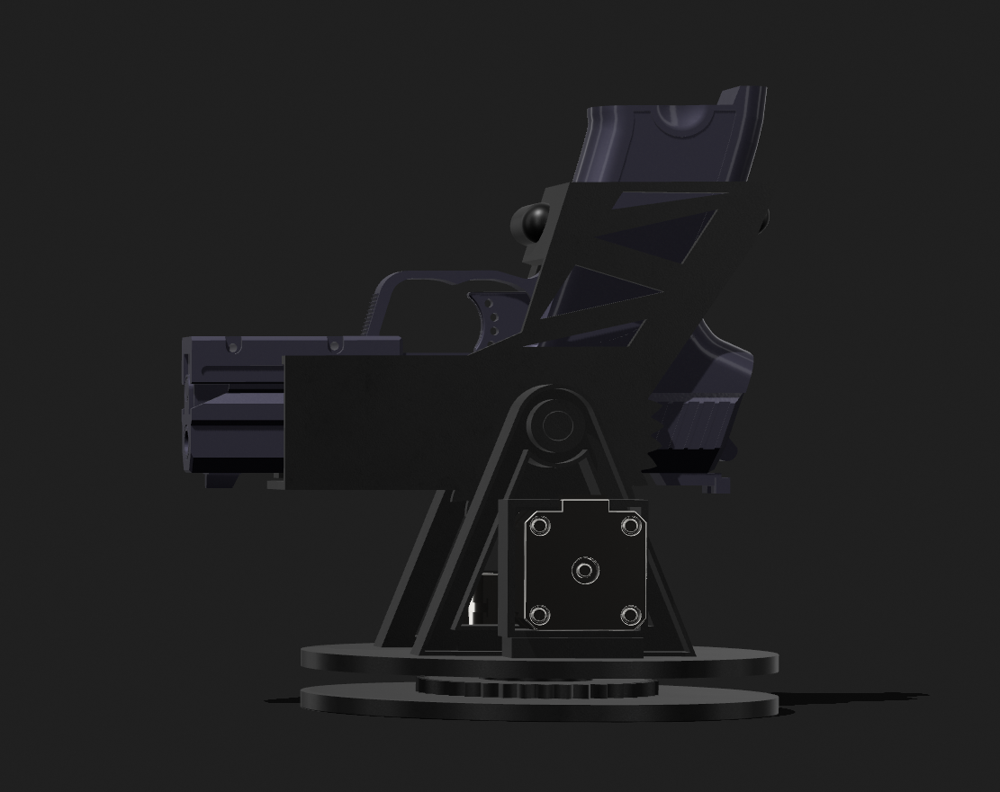
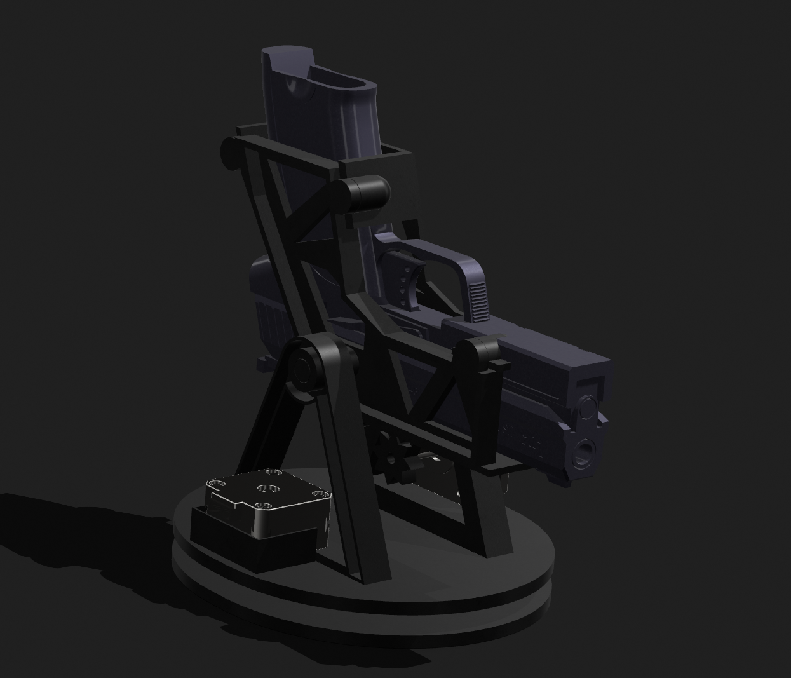

# ARES

**ARES – Assisted Remote Engagement System**

## Sommaire

- [Aperçu du système](#aperçu-du-système)
- [Description du système](#description-du-système)
- [Fonctionnalités](#fonctionnalités)
- [Architecture matérielle](#architecture-matérielle)
- [Architecture du firmware](#architecture-du-firmware)
- [Modes de fonctionnement](#modes-de-fonctionnement)
- [Connexion](#connexion)
- [Compilation](#compilation)

## Aperçu du système





ARES est une plateforme robotique expérimentale basée sur une architecture **à deux ESP32** : un ESP32 dédié au contrôle du robot et un **ESP32‑CAM** dédié au streaming vidéo.

Le système permet de contrôler à distance l’orientation d’une tourelle robotisée et de visualiser en temps réel le flux vidéo de la caméra via une interface web embarquée.

Le projet combine plusieurs domaines :

- vision embarquée
- contrôle de moteurs pas à pas
- interface web embarquée
- contrôle local et distant
- robotique expérimentale

---

# Description du système

ARES est une plateforme robotique expérimentale permettant d’explorer différents concepts de robotique embarquée.

L’architecture actuelle repose sur une séparation des responsabilités :

- **ESP32 contrôleur** : gestion des moteurs, des entrées physiques et de l’interface de commande
- **ESP32‑CAM** : gestion indépendante de la caméra et du streaming vidéo

Cette séparation permet d’isoler la charge réseau et vidéo du contrôle temps réel du robot.

Le prototype actuel utilise un **mécanisme airsoft basse puissance** intégré à la tourelle afin de tester le contrôle mécanique du système et la synchronisation entre :

- les moteurs
- l’interface web
- le retour vidéo
- les commandes locales

L’objectif principal du projet est d’expérimenter des systèmes embarqués combinant **vision, contrôle moteur et interface réseau**.

---

# Fonctionnalités

- Streaming vidéo temps réel depuis un ESP32‑CAM dédié
- Contrôle des moteurs de la tourelle via interface web
- Mode WiFi autonome (ESP32 en point d’accès)
- Accès via `http://ares.local`
- Contrôle local via boutons physiques
- Sélecteur de mode **LOCAL / REMOTE**
- Mécanisme de tir contrôlé par moteur pas à pas
- Architecture firmware non bloquante

---

# Architecture matérielle

Le système est composé de deux sous-ensembles principaux :

### Module Guardian (contrôle de la tourelle)

- ESP32 (contrôleur principal)
- 3 moteurs NEMA17
- Drivers DRV8825
- Extension GPIO MCP23017
- caméra embarquée
- Mécanisme airsoft basse puissance (expérimental)

### Module caméra

- ESP32‑CAM
- caméra OV3660
- serveur HTTP de streaming MJPEG
- diffusion du flux vidéo accessible via l’interface web

### Station opérateur

Interface de contrôle permettant :

- visualisation du flux vidéo
- contrôle des moteurs
- déclenchement du mécanisme

---

# Architecture du firmware

Le firmware est réparti sur deux microcontrôleurs :

- **ESP32 contrôleur** : logique du robot et interface de commande
- **ESP32‑CAM** : gestion du streaming vidéo

Le firmware est structuré autour de plusieurs modules :

## Motor

Gestion générique des moteurs pas à pas :

- génération des impulsions STEP
- gestion des directions
- gestion des intervalles de pas
- fonctionnement non bloquant via `update()`

## Button

Lecture des boutons physiques via l’extension GPIO.

## Inter

Gestion du sélecteur de mode :

- LOCAL
- REMOTE

## Camera

Gestion du streaming vidéo via le serveur HTTP intégré.

## main.cpp

Orchestration générale du système :

- initialisation matériel
- configuration WiFi
- gestion des moteurs
- lecture des commandes

---

# Modes de fonctionnement

## Mode REMOTE

Le contrôle est effectué via l’interface web :

- orientation de la tourelle
- déclenchement du mécanisme
- visualisation du flux vidéo

## Mode LOCAL

Le contrôle est effectué via les boutons physiques présents sur le robot.

---

# Connexion

Le **ESP32 contrôleur** crée son propre réseau WiFi en mode **point d’accès (Access Point)**.

Le **ESP32‑CAM** se connecte à ce réseau comme un client WiFi.

L’architecture réseau fonctionne alors de la manière suivante :

1. L’utilisateur se connecte au réseau WiFi **ARES**.
2. L’interface web est servie par le **ESP32 contrôleur**.
3. La page web intègre le flux vidéo provenant du **ESP32‑CAM**.
4. Le navigateur récupère donc :
   - l’interface de contrôle depuis l’ESP32 contrôleur
   - le flux vidéo depuis l’ESP32‑CAM.

Cette architecture permet de séparer :

- le **contrôle temps réel du robot** (ESP32 contrôleur)
- le **traitement et la diffusion vidéo** (ESP32‑CAM).

Le contrôleur ne traite pas la vidéo, ce qui évite de surcharger le microcontrôleur responsable du pilotage des moteurs.

Configuration du réseau WiFi :

SSID : ARES
Mot de passe : 12345678

Interface web :

http://ares.local

ou

http://192.168.4.1

---

# Compilation

Le firmware est développé avec **PlatformIO**.

Pour compiler le projet :

```bash
pio run
```

Pour flasher l’ESP32 :

```bash
pio run -t upload
```

Pour ouvrir le moniteur série :

```bash
pio device monitor
```

---

# Statut

Projet expérimental en développement.

Le firmware actuel est **fonctionnel sur le matériel** :

- contrôle des moteurs
- streaming vidéo
- contrôle local via boutons
- contrôle distant via interface web
- mécanisme airsoft fonctionnel

Cette architecture pose les bases pour les évolutions futures du système **ARES**.

---

# Note de sécurité

ARES est un projet expérimental destiné à l’apprentissage et à la recherche personnelle en robotique embarquée.

Le système doit être utilisé uniquement dans un environnement privé et contrôlé.

L'utilisateur est responsable de respecter les réglementations locales concernant l'utilisation de dispositifs airsoft ou similaires.

# Licence

Projet distribué à des fins éducatives et expérimentales.
