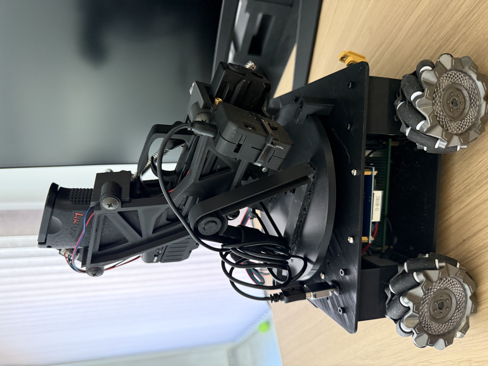
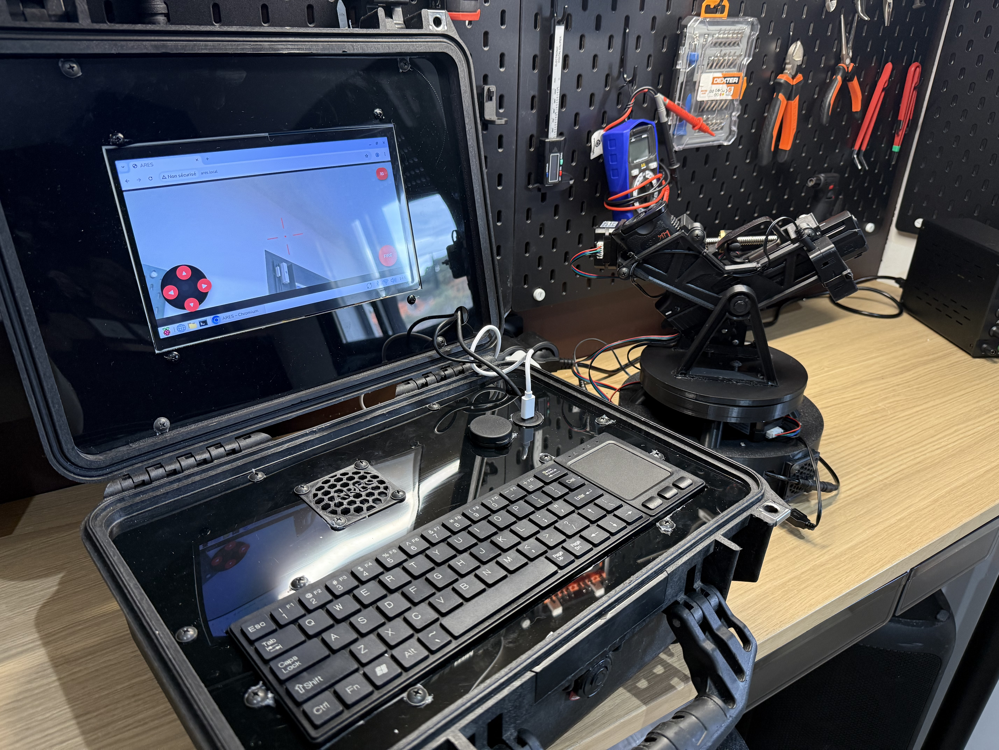

# ARES

**ARES – Assisted Remote Engagement System**

## Sommaire

- [Aperçu du système](#aperçu-du-système)
- [Description du système](#description-du-système)
- [Fonctionnalités](#fonctionnalités)
- [Architecture matérielle](#architecture-matérielle)
- [Architecture du firmware](#architecture-du-firmware)
- [Commandes HTTP](#commandes-http)
- [Connexion](#connexion)
- [Compilation](#compilation)

## Aperçu du système




ARES est une plateforme robotique expérimentale composée de trois modules ESP32 : un contrôleur de tourelle, un contrôleur de châssis mecanum et un **ESP32‑CAM** dédié au streaming vidéo.

Une interface web permet de piloter à distance le châssis et la tourelle, de visualiser le flux vidéo et de sélectionner une zone à suivre dans l’image.

Le projet combine plusieurs domaines :

- vision embarquée
- contrôle de moteurs pas à pas
- interface web embarquée
- contrôle distant du châssis et de la tourelle
- robotique expérimentale

---

# Description du système

ARES est une plateforme robotique expérimentale permettant d’explorer différents concepts de robotique embarquée.

L’architecture repose sur une séparation des responsabilités :

- **ESP32 de la tourelle** : moteurs pas à pas, commandes HTTP et interface web
- **ESP32 du châssis** : quatre moteurs à courant continu et déplacement mecanum
- **ESP32‑CAM** : caméra et streaming vidéo MJPEG

La séparation des modules isole le streaming vidéo des commandes de déplacement et de tourelle.

Le prototype actuel utilise un **mécanisme airsoft basse puissance** intégré à la tourelle afin de tester le contrôle mécanique du système et la synchronisation entre :

- les moteurs
- l’interface web
- le retour vidéo
- les commandes de déplacement du châssis

L’objectif principal du projet est d’expérimenter des systèmes embarqués combinant **vision, contrôle moteur et interface réseau**.

---

# Fonctionnalités

- Streaming vidéo temps réel depuis un ESP32‑CAM dédié
- Contrôle des moteurs de la tourelle et du châssis via interface web
- Suivi visuel côté navigateur d’une zone sélectionnée dans la vidéo
- Commande du pointeur laser depuis l’interface web
- Mode Wi‑Fi autonome, avec l’ESP32 de la tourelle comme point d’accès
- Accès via `http://ares.local`
- Mécanisme de tir contrôlé par moteur pas à pas
- Architecture firmware non bloquante

---

# Architecture matérielle

Le système est composé de trois modules principaux :

### Module Guardian (contrôle de la tourelle)

- ESP32 (contrôleur principal)
- 3 moteurs NEMA17
- Drivers DRV8825
- Extension GPIO MCP23017
- pointeur laser commandé par l’ESP32
- serveur HTTP pour l’interface et les commandes
- Mécanisme airsoft basse puissance (expérimental)

### Module châssis

- ESP32-S3
- quatre moteurs à courant continu pilotés par deux cartes TB6612
- roues mecanum pour avancer, reculer, tourner et se déplacer latéralement

### Module caméra

- ESP32‑CAM
- caméra OV3660
- serveur HTTP de streaming MJPEG
- diffusion du flux vidéo accessible via l’interface web

### Station opérateur

Interface de contrôle permettant :

- visualisation du flux vidéo
- contrôle des moteurs
- activation et désactivation du pointeur laser
- déclenchement du mécanisme

---

# Architecture du firmware

Le firmware est réparti entre trois microcontrôleurs :

- [`guardian-module/firmware`](guardian-module/firmware) : tourelle et interface web
- [`guardian-module/chassis-firmware`](guardian-module/chassis-firmware) : déplacement mecanum
- [`guardian-module/firmwareEspCam`](guardian-module/firmwareEspCam) : caméra et streaming vidéo

Le firmware est structuré autour de plusieurs modules :

## Motor

Gestion générique des moteurs pas à pas :

- génération des impulsions STEP
- gestion des directions
- gestion des intervalles de pas
- fonctionnement non bloquant via `update()`

## Camera

Gestion du streaming vidéo via le serveur HTTP intégré.

## main.cpp

Orchestration générale du système :

- initialisation matériel
- configuration WiFi
- gestion des moteurs
- lecture des commandes

### Châssis

- `MotorDC` pilote chaque moteur de roue.
- `MecanumChassis` combine les roues pour les translations et rotations.
- `Serveur.cpp` reçoit les commandes HTTP sur le port 80.

## Commandes HTTP

Le contrôleur du châssis accepte `GET /control?cmd=...` avec les commandes `forward`, `backward`, `strafe_left`, `strafe_right`, `rotate_left`, `rotate_right` et `stop`. Le paramètre `speed` est facultatif et borné entre 0 et 255.

Le contrôleur de la tourelle accepte `GET /control?var=pan&val=-1|0|1` et `GET /control?var=tilt&val=-1|0|1` pour les mouvements. La page commande le pointeur laser avec `GET /control?var=laser&val=1` (marche) ou `val=0` (arrêt), et lance un cycle de tir avec `GET /control?var=Fire&val=1`.

La sélection dans l’interface suit l’apparence d’une zone de l’image ; ce n’est pas une détection automatique par catégorie.

---

# Connexion

L’ESP32 de la tourelle crée le réseau Wi‑Fi en mode **point d’accès (Access Point)**.

L’ESP32‑CAM et le contrôleur de châssis se connectent à ce réseau comme clients Wi‑Fi.

L’architecture réseau fonctionne alors de la manière suivante :

1. L’utilisateur se connecte au réseau WiFi **ARES**.
2. L’interface web est servie par l’ESP32 de la tourelle via `http://ares.local`.
3. La page envoie les commandes de déplacement à `http://areschassis.local`.
4. Le flux vidéo provient de `http://arescam.local:81/stream`.

Cette architecture sépare :

- le contrôle de la tourelle
- le contrôle du châssis
- la diffusion vidéo.

Configure le même SSID et le même mot de passe dans les fichiers de configuration des trois modules. N’utilise pas un mot de passe personnel dans le dépôt public.

---

# Compilation

Chaque firmware est un projet PlatformIO distinct. Depuis la racine du dépôt, compile chaque module depuis son dossier :

```bash
cd guardian-module/firmware
pio run
```

Châssis :

```bash
cd guardian-module/chassis-firmware
pio run
```

Caméra :

```bash
cd guardian-module/firmwareEspCam
pio run
```

Pour flasher un module, lance `pio run -t upload` depuis son dossier. Pour ouvrir son moniteur série, lance `pio device monitor` depuis le même dossier.

---

# Statut

Projet expérimental en développement. Le dépôt regroupe les firmwares du châssis, de la tourelle et de la caméra ainsi que l’interface web. Le fonctionnement complet dépend de la configuration et du matériel utilisés.

---

# Note de sécurité

ARES est un projet expérimental destiné à l’apprentissage et à la recherche personnelle en robotique embarquée.

Le système doit être utilisé uniquement dans un environnement privé et contrôlé.

L'utilisateur est responsable de respecter les réglementations locales concernant l'utilisation de dispositifs airsoft ou similaires.

# Licence

Projet distribué à des fins éducatives et expérimentales.
